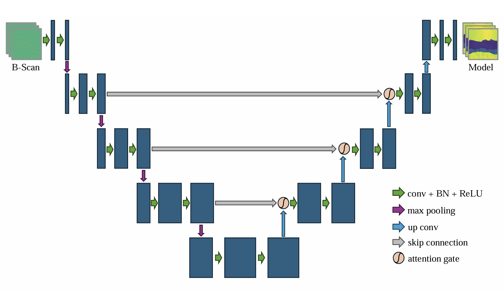
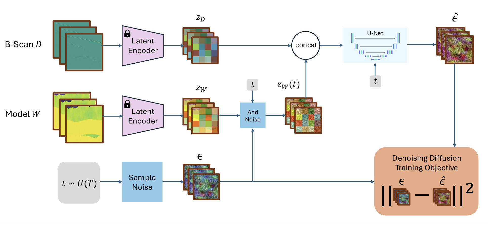

# U-Net and Diffusion Models for One Shot MO-GPR Data Completion and Full Waveform Inversion

This is the code for the GNN 24/25ws final project.

The code of discriminative models such as U-Net is in `./discriminative_model`.



The code of  generative models such as diffusion are in `./generative_model`.



Please set the environment according to the respective internal `requirements.txt`. If you need to simulate data, please set the `gprMax` environment according to the following. 

```bash
pip install pycuda
git clone https://github.com/gprMax/gprMax.git
```

Go to gprMax folder, at materials.py, and change the last function at the end of the page to the following function.

```python
# def calculate_debye_properties(self, nbins, G, fractalboxname):

#         self.startmaterialnum = len(G.materials)

#         mubins = np.linspace(self.mu[0], self.mu[1], nbins)
#         mumaterials = mubins + (mubins[1] - mubins[0]) / 2

#         muiter = np.nditer(mumaterials, flags=['c_index'])
#         while not muiter.finished:
#             er = muiter[0]

#             sig = er/10000

#             digitscount =  len(str(int(nbins)))
#             materialID = '|{}_{}|'.format(fractalboxname, str(muiter.index + 1).zfill(digitscount))
#             m = Material(len(G.materials), materialID)
#             m.type = ''
#             m.averagable = False

#             m.er = er
#             m.se = sig

#             G.materials.append(m)

#             muiter.iternext()
```

```bash
cd gprMax
python setup.py build
python setup.py install
```

